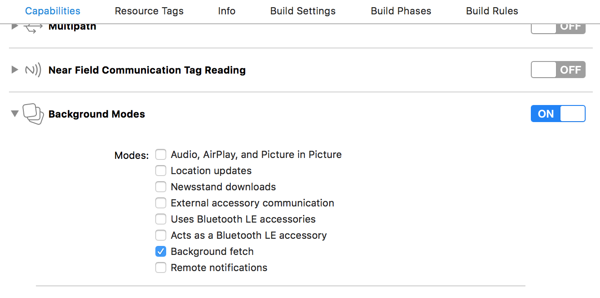

# Installation #

Minimum Requirements: **Deployment target iOS 9**

To start using the SDK, include this in your app *Podfile*

pod 'NearITSDKSwift' // For Swift

pod 'NearITSDK' // For Objective-C

 
In the `application(_ application: UIApplication, didFinishLaunchingWithOptions launchOptions: [UIApplicationLaunchOptionsKey: Any]?) -> Bool` method of your AppDelegate class, set the API token to the SDK a String

import NearITSDKSwift

func application(_ application: UIApplication, didFinishLaunchingWithOptions launchOptions: [UIApplicationLaunchOptionsKey: Any]?) -> Bool {
	...
    NearManager.setup(apiKey: "&lt;your API token here&gt;")
	let manager = NearManager.shared
	...
}

#import &lt;NearITSDK/NearITSDK.h&gt;

- (BOOL)application:(UIApplication *)application didFinishLaunchingWithOptions:(NSDictionary *)launchOptions {
    ...
    [NITManager setupWithApiKey:@"&lt;your API token here&gt;"];
    NITManager *manager = [NITManager defaultManager];
    ...
}

You can find the API key on <a href="https://go.nearit.com/" target="_blank">**NearIT web interface**</a>, under the "**Settings> SDK Integration**" section.
 

## Auto update
To keep your app up to date even if a user is not using the app, you have to call the sdk method developed to support the iOS feature called **background fetch**.

First thing to do is to enable the feature **background fetch** in the capabilities section of your app project.

In your code you need to call the method *application:performFetchWithCompletionHandler* of the Near manager in your AppDelegate, inside the iOS method *application:performFetchWithCompletionHandler*.

// Call the method application(_ application: UIApplication, performFetchWithCompletionHandler completionHandler: @escaping (UIBackgroundFetchResult) -> Void) on the Near manager instance
func application(_ application: UIApplication, performFetchWithCompletionHandler completionHandler: @escaping (UIBackgroundFetchResult) -> Void) {
    nearManager.application(application) { (fetchResult) in
        completionHandler(fetchResult)
    }
}

- (void)application:(UIApplication *)application performFetchWithCompletionHandler:(void (^)(UIBackgroundFetchResult))completionHandler {
    [nearManager application:application performFetchWithCompletionHandler:^(UIBackgroundFetchResult result) {
        completionHandler(result);
    }];
}

Then in the `application(_ application: UIApplication, didFinishLaunchingWithOptions launchOptions: [UIApplicationLaunchOptionsKey: Any]?) -> Bool` method of your AppDelegate class, set the minimun background fetch interval (2 hours is recommended):

func application(_ application: UIApplication, didFinishLaunchingWithOptions launchOptions: [UIApplicationLaunchOptionsKey: Any]?) -> Bool {
    ...
    application.setMinimumBackgroundFetchInterval(7200) // 2 hours
    ...
}

- (BOOL)application:(UIApplication *)application didFinishLaunchingWithOptions:(NSDictionary *)launchOptions {
    ...
    [application setMinimumBackgroundFetchInterval:7200]; // 2 hours
    ...
}

## Enable test devices
Test Devices allow you to test NearIT features on single devices and is extremely useful for debugging.

Navigate **"Settings > Test devices"** section of NearIT and follow the instructions to enable this feature.

In the same section, you can send invite links to mail addresses. If users have the app installed, they can click the link on their smart-phone to be prompted with a request to enroll their device among the testers.

After the `Info.plist` update, you should override the AppDelegate method for url management:

func application(_ app: UIApplication, open url: URL, options: [UIApplicationOpenURLOptionsKey : Any] = [:]) -> Bool {
    return NearManager.shared.application(app, open: url, options: options)
}

- (BOOL)application:(UIApplication *)app openURL:(NSURL *)url options:(NSDictionary<UIApplicationOpenURLOptionsKey,id> *)options {
    [[NITManager defaultManager] application:app openURL:url options:options];
}

